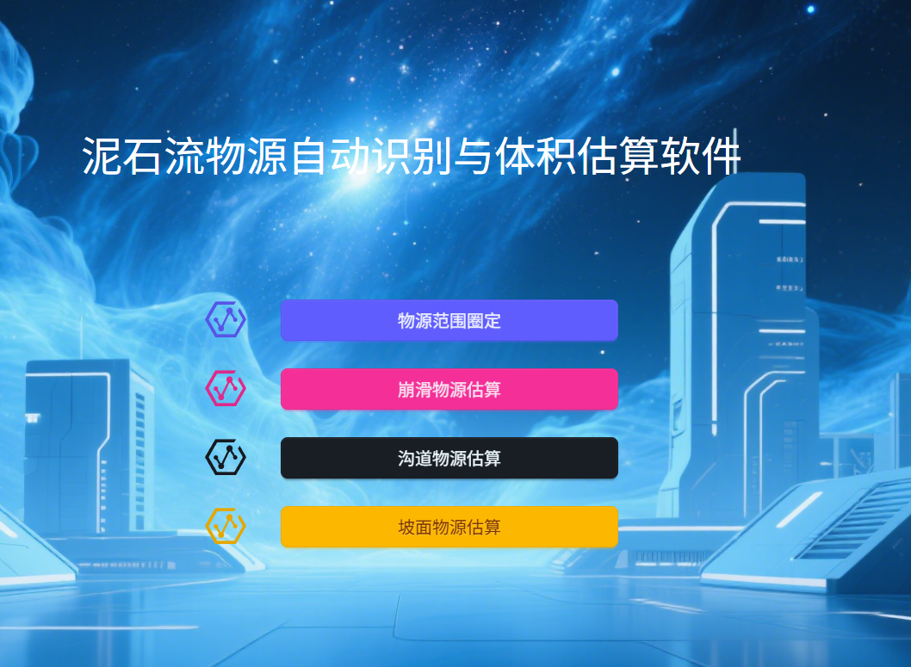
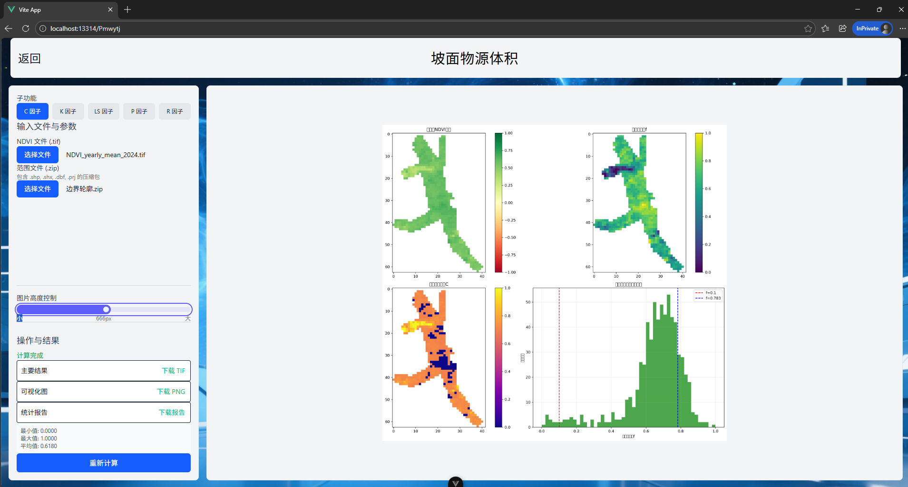

网页体验：https://wild-deer.github.io/demo_ScensUI_3/
# 项目截图


# 部署说明

## 环境依赖

本项目使用 Conda 管理环境，请确保已安装 [Anaconda](https://www.anaconda.com/) 或 [Miniconda](https://docs.conda.io/en/latest/miniconda.html)。

1.  **创建环境**

    在 `api` 目录下运行以下命令创建 Conda 环境：

    ```bash
    conda env create -f environment.yml
    ```

2.  **激活环境**

    ```bash
    conda activate demo_scensUI_3_api
    ```

3.  **启动服务**

    确保在 `api` 目录下，运行以下命令启动 API 服务：

    ```bash
    python main.py
    ```

    或者使用 uvicorn 直接启动：

    ```bash
    uvicorn main:app --host 0.0.0.0 --port 25376
    ```

    服务启动后，API 将监听 `0.0.0.0:25376`。

    部署完毕后访问 `https://wild-deer.github.io/demo_ScensUI_3/`即可开始使用
